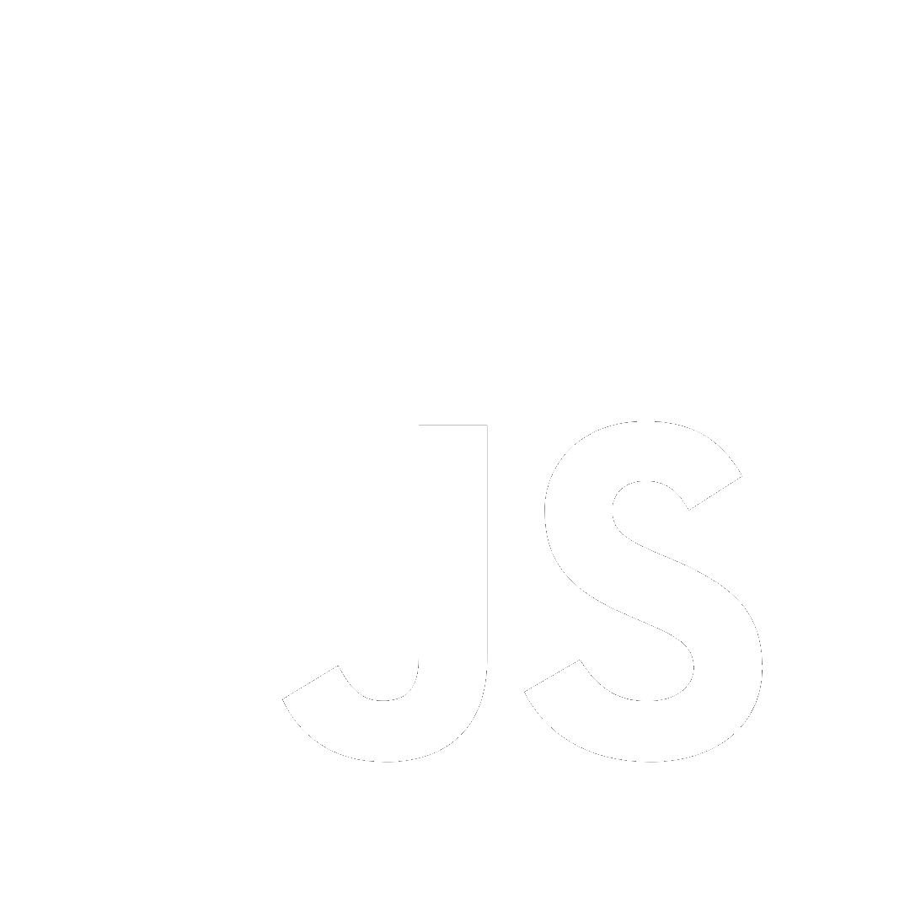
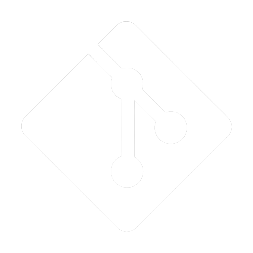
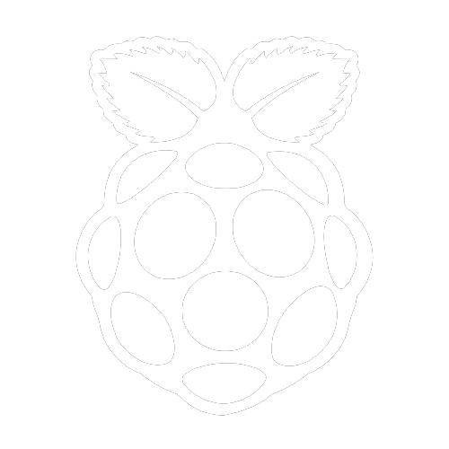
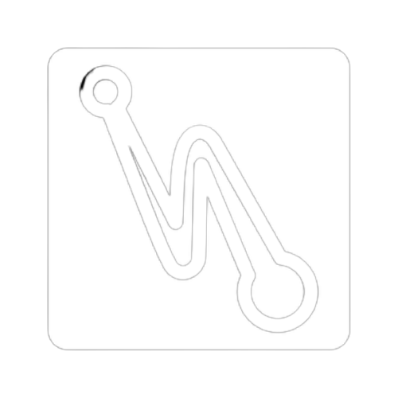

# Spencer Boggs

**`Programming stupid shit to keep myself entertained`**

I make dumb videogames on graphing calculators, program LEDs that blind you if you stare too long, and set shit on fire. If anyone has any suggestion for a stupid program I should make let me know. Programming stupid shit is way better than paying attention in school.

    

---

## Tools and Languages

 

---

## Social Stuff

 

 

---
## Organizations

 

---
## Support

 
 

---

## My Stats

&nbsp;

